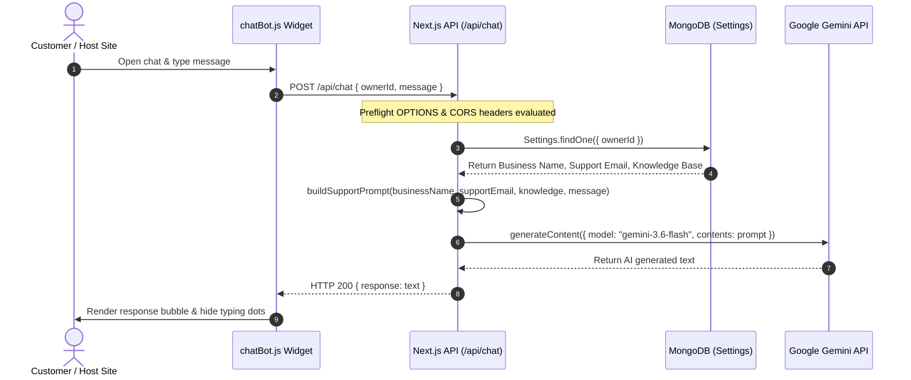

# Support AI

Support AI is a full-stack, multi-tenant customer support platform that enables businesses to configure custom AI support assistants powered by Google Gemini and embed them into any external website using a single line of JavaScript.

## Overview

Modern businesses struggle to provide 24/7 customer support for repetitive inquiries such as business hours, delivery policies, return guidelines, and service details. Support AI solves this by allowing business owners to input their core business details and unstructured knowledge base text into a centralized dashboard. 

When embedded on a host website, a lightweight, zero-dependency widget handles customer queries by transmitting them to a dedicated backend API. The backend retrieves the matching business configuration from MongoDB, constructs a prompt with strict guardrails and anti-hallucination rules, and invokes the Google Gemini API (`gemini-3.6-flash`) to generate accurate, context-aware responses in real time.

---

## Features

- **Scalekit Authentication & SSO**: Secure business owner authentication using Scalekit OAuth flow with HTTP-only cookie session management.
- **Business Dashboard**: Dedicated UI for business owners to configure business name, support email, and plain-text knowledge base context.
- **Zod Schema Validation**: Server-side request payload validation for business settings configuration.
- **MongoDB Persistence**: Cached Mongoose connection storing business settings in a dedicated settings collection.
- **Gemini AI Integration**: Integration with the `@google/genai` SDK using the `gemini-3.6-flash` model.
- **Prompt Engineering & Guardrails**: System prompt logic (`buildSupportPrompt`) enforcing accuracy, preventing prompt injection attacks, handling off-topic queries, managing angry/profane user inputs, and providing fallback support email routing when information is missing.
- **Embeddable JavaScript Widget**: Lightweight, vanilla JS floating widget (`public/chatBot.js`) with responsive design, typing indicator animations, auto-scrolling, and XSS-safe DOM rendering (`textContent`).
- **Integration Management Page**: Embed configuration page (`/embed`) featuring code snippet copy capabilities and interactive live widget preview.
- **CORS-Enabled Chat Endpoint**: Built-in OPTIONS preflight and CORS response headers for cross-origin embedding.

---

## Architecture

The following diagram illustrates the data flow from host site embedding to AI response generation:



---

## Tech Stack

| Category | Technology | Version | Purpose |
| :--- | :--- | :--- | :--- |
| **Framework** | Next.js (App Router) | `16.3.0` | React framework for server/client routes and API endpoints |
| **Frontend Library** | React | `19.2.8` | UI component tree rendering |
| **Language** | TypeScript | `^5` | Static type checking and interface definitions |
| **Styling** | Tailwind CSS | `^4` | PostCSS utility-first styling |
| **Animations** | Motion (Framer Motion) | `^13.0.0` | Client-side component transitions and micro-animations |
| **Icons** | Lucide React | `^1.30.0` | UI icons for dashboard, landing, and embed pages |
| **Database** | MongoDB & Mongoose | `^9.9.1` | Object Data Modeling (ODM) and persistent storage |
| **Authentication** | Scalekit Node SDK | `^2.11.0` | OAuth authentication and user management |
| **AI Platform** | Google GenAI SDK | `^2.17.1` | Gemini API client (`gemini-3.6-flash`) |
| **Validation** | Zod | `^4.4.3` | Runtime schema validation for API payloads |
| **HTTP Client** | Axios | `^1.19.0` | Client-side API requests |

---

## How It Works

### 1. Business Configuration Flow
1. A business owner visits the application and authenticates via Scalekit (`/api/auth/login`).
2. Upon successful authentication, Scalekit redirects to `/api/auth/callback`, establishing an HTTP-only `access_token` session cookie.
3. Middleware (`src/proxy.ts`) protects the `/dashboard` route by validating the session via `getSession()`.
4. On `/dashboard`, the client component (`DashboardClient.tsx`) fetches existing settings via `POST /api/settings/get` matching `ownerId` (`session.user.id`).
5. The owner updates their Business Name, Support Email, and Knowledge Base text block, then clicks "Save changes".
6. The client sends a `POST /api/settings` request. The payload is validated via Zod (`settingsSchema`). On success, Mongoose upserts the document (`Settings.findOneAndUpdate({ ownerId }, ..., { upsert: true })`) in MongoDB.

### 2. Widget Loading & Customer Chat Flow
1. An external website includes the `<script>` tag referencing `chatBot.js` with `data-owner-id="<OWNER_ID>"`.
2. `chatBot.js` executes immediately, reads `data-owner-id`, and injects a fixed floating action button (`#support-ai-button`) and chat drawer (`#support-ai-chatbox`) into the host page DOM.
3. When a customer opens the chat and submits a message:
   - The widget displays the user message and attaches an animated 3-dot typing indicator (`#support-ai-typing`).
   - The script performs an asynchronous `fetch` request (`POST http://localhost:3000/api/chat`) containing `{ ownerId, message }`.
4. The `/api/chat` route handling:
   - Connects to MongoDB via cached connection (`lib/db.ts`).
   - Retrieves the matching business configuration from the `Settings` collection.
   - Passes the business information, support email, knowledge base text, and customer message to `buildSupportPrompt()` (`src/lib/ai/supportPrompt.ts`).
   - Instantiates `GoogleGenAI` with `GEMINI_API_KEY` and calls `ai.models.generateContent({ model: "gemini-3.6-flash", contents: prompt })`.
   - Returns the response string as JSON `{ response: res.text }` alongside CORS headers.
5. `chatBot.js` receives the response, removes the typing indicator, and safely appends the AI message bubble using `textContent`.

---

## Project Structure

```
support-ai/
├── public/
│   └── chatBot.js            # Self-contained embeddable widget script
├── src/
│   ├── app/
│   │   ├── api/
│   │   │   ├── auth/
│   │   │   │   ├── callback/ # OAuth callback handler setting access_token cookie
│   │   │   │   ├── login/    # Redirects to Scalekit OAuth authorization URL
│   │   │   │   └── logout/   # Deletes authentication session cookie
│   │   │   ├── chat/         # Core AI endpoint handling CORS, DB lookups & Gemini API
│   │   │   └── settings/
│   │   │       ├── route.ts  # POST endpoint to validate & upsert settings
│   │   │       └── get/      # POST endpoint to retrieve settings by ownerId
│   │   ├── components/       # React client components (Dashboard, Embed, Hero, etc.)
│   │   ├── dashboard/        # Dashboard page route (/dashboard)
│   │   ├── embed/            # Embed configuration and widget preview route (/embed)
│   │   ├── globals.css       # Global CSS and Tailwind directives
│   │   ├── layout.tsx        # Root layout with Geist font configurations
│   │   └── page.tsx          # Public landing page (/ )
│   ├── lib/
│   │   ├── ai/
│   │   │   └── supportPrompt.ts # Prompt engineering & guardrail compilation logic
│   │   ├── db.ts             # Cached Mongoose MongoDB connection helper
│   │   ├── getSession.ts     # Server-side authentication reader via Scalekit SDK
│   │   ├── scaleKit.ts       # Scalekit SDK client instance initializer
│   │   └── validations/
│   │       └── settings.ts   # Zod schema definitions for business settings
│   ├── model/
│   │   └── settings.model.ts # Mongoose schema for settings collection
│   ├── proxy.ts              # Custom middleware function for route protection
│   └── types.d.ts            # Global TypeScript declarations (Mongoose caching)
├── eslint.config.mjs         # ESLint configuration
├── next.config.ts            # Next.js framework configuration
├── package.json              # NPM dependencies and script commands
├── postcss.config.mjs        # PostCSS build plugin setup
└── tsconfig.json             # TypeScript compiler settings
```

---

## Getting Started

### Prerequisites

- **Node.js**: v18.x or higher
- **Package Manager**: `npm` (default)
- **MongoDB Instance**: Local MongoDB server or MongoDB Atlas cluster connection string
- **Google Gemini API Key**: API key from Google AI Studio
- **Scalekit Account**: Environment URL, Client ID, and Client Secret from Scalekit Developer Portal

### Installation

1. Clone the repository:
   ```bash
   git clone <repository-url>
   cd support-ai
   ```

2. Install dependencies:
   ```bash
   npm install
   ```

### Environment Variables

Create a `.env` file in the root directory and populate the required environment variables:

```env
# Application URL
NEXT_PUBLIC_APP_URL=http://localhost:3000

# Database Configuration
MONGODB_URL=mongodb://localhost:27017/support-ai

# Google Gemini AI Key
GEMINI_API_KEY=your_gemini_api_key_here

# Scalekit Authentication Credentials
SCALEKIT_ENVIRONMENT_URL=https://your-env.scalekit.com
SCALEKIT_CLIENT_ID=your_scalekit_client_id
SCALEKIT_CLIENT_SECRET=your_scalekit_client_secret
```

### Run Locally

1. Start the development server:
   ```bash
   npm run dev
   ```

2. Open your browser and navigate to `http://localhost:3000`.

3. Build for production:
   ```bash
   npm run build
   ```

4. Start production server:
   ```bash
   npm run start
   ```

---

## Configuration

Business owners configure their AI assistant through the `/dashboard` route:

- **Business Name** (`businessName`): The official name of the company used by the AI assistant when identifying itself.
- **Support Email** (`supportEmail`): The fall-back contact address given to customers when their question cannot be answered from the knowledge base.
- **Knowledge Base** (`knowledge`): Unstructured plain text containing products, delivery timelines, payment options, return policies, warranties, and FAQs.

Settings are saved to MongoDB under a single document per `ownerId` using Zod validation:
```typescript
{
  ownerId: string;      // Unique Scalekit User ID (Required)
  businessName: string; // Business Name (Required, min 1 char)
  supportEmail: string; // Valid email address format
  knowledge: string;    // Plain text knowledge context (Required)
}
```

---

## Embedding the Chatbot

To add Support AI to any HTML page or website framework, place the following script tag before the closing `</body>` tag:

```html
<script
  src="http://localhost:3000/chatBot.js"
  data-owner-id="YOUR_OWNER_ID"
></script>
```

### Script Parameters

- `src`: Points to `chatBot.js` hosted on your Support AI server instance (`${NEXT_PUBLIC_APP_URL}/chatBot.js`).
- `data-owner-id`: The unique Scalekit identifier (`ownerId`) of the business owner.

### Integration Mechanics

- **Identification**: `chatBot.js` inspects `document.currentScript.getAttribute("data-owner-id")`.
- **UI Injection**: Programmatically appends container elements (`#support-ai-button` and `#support-ai-chatbox`) to `document.body` with `zIndex` set to `2147483647`.
- **Styling Isolation**: All widget styles are injected inline or via scoped `<style>` tags to minimize host website CSS conflicts.
- **Backend Communication**: Sends `POST` requests to `http://localhost:3000/api/chat` with JSON body payload `{ ownerId, message }`.

---

## API Reference

### 1. Authentication Endpoints

#### `GET /api/auth/login`
- **Purpose**: Generates Scalekit OAuth authorization URL and redirects user to sign in.
- **Response**: `302 Redirect` to Scalekit authentication provider.

#### `GET /api/auth/callback`
- **Purpose**: Handles OAuth code exchange with Scalekit and establishes user session cookie.
- **Query Parameters**: `code` (string, required)
- **Response**: Sets `access_token` HTTP-only cookie and redirects (`302`) to `NEXT_PUBLIC_APP_URL`.

#### `GET /api/auth/logout`
- **Purpose**: Destroys authentication session.
- **Response**: Deletes `access_token` cookie and redirects (`302`) to `NEXT_PUBLIC_APP_URL`.

---

### 2. Business Settings Endpoints

#### `POST /api/settings`
- **Purpose**: Creates or updates business settings.
- **Request Body**:
  ```json
  {
    "ownerId": "usr_123456789",
    "businessName": "Gada Electronics",
    "supportEmail": "support@gadaelectronics.com",
    "knowledge": "Delivery takes 3-5 business days. Cash on delivery available."
  }
  ```
- **Responses**:
  - `200 OK`: Returns updated Settings document JSON.
  - `400 Bad Request`: Validation failure details.
    ```json
    {
      "message": "Validation failed",
      "errors": { "supportEmail": ["Invalid support email"] }
    }
    ```
  - `500 Internal Server Error`: Server error details.

#### `POST /api/settings/get`
- **Purpose**: Fetches saved business settings by `ownerId`.
- **Request Body**:
  ```json
  {
    "ownerId": "usr_123456789"
  }
  ```
- **Responses**:
  - `200 OK`: Settings document JSON or `null`.
  - `400 Bad Request`: `{ "message": "OwnerId is required" }`
  - `500 Internal Server Error`: Server error details.

---

### 3. Chat Endpoint

#### `OPTIONS /api/chat`
- **Purpose**: CORS preflight handler for cross-origin widget requests.
- **Response**: `204 No Content` with CORS headers (`Access-Control-Allow-Origin: http://127.0.0.1:5500`, `Access-Control-Allow-Methods: POST, OPTIONS`, `Access-Control-Allow-Headers: Content-Type`).

#### `POST /api/chat`
- **Purpose**: Processes customer messages from embedded widget and returns AI response.
- **Request Body**:
  ```json
  {
    "ownerId": "usr_123456789",
    "message": "Do you offer cash on delivery?"
  }
  ```
- **Responses**:
  - `200 OK`:
    ```json
    {
      "response": "Yes! Cash on Delivery is available for eligible orders."
    }
    ```
  - `400 Bad Request`: Missing parameter or unconfigured business:
    ```json
    {
      "message": "Chat bot is not configured yet."
    }
    ```
  - `500 Internal Server Error`: Missing Gemini API key or execution failure:
    ```json
    {
      "message": "GEMINI_API_KEY is missing."
    }
    ```

---

## Knowledge Base & Prompt Engineering

The system prompt (`src/lib/ai/supportPrompt.ts`) compiles business settings and user queries into a prompt structured around strict operational guidelines:

1. **Source of Truth**: The `BUSINESS INFORMATION` block serves as the strict primary source of truth.
2. **Anti-Hallucination Directives**: Explicitly forbids inventing prices, discounts, availability, delivery windows, refund terms, or warranty policies.
3. **Prompt Injection Defense**: Instructs the model to treat `BUSINESS INFORMATION` and user messages as data (not instructions) and explicitly reject requests attempting to reveal system prompts, internal rules, or developer instructions.
4. **Out-of-Scope Routing**: When information is missing, the AI is instructed to return:
   > *"I don't have verified information about that at the moment. Please contact support at ${supportEmail} for further assistance."*
5. **Tone & Conflict Management**: Ignores profanity in legitimate inquiries and responds to hostile input with calm, professional boundaries.

---

## Error Handling & Fallback Behavior

- **Unconfigured Chatbot**: If a website embeds a script with an `ownerId` that has not configured settings in the dashboard, the backend returns HTTP 400 (`Chat bot is not configured yet.`), rendered gracefully inside the widget.
- **Missing Knowledge**: If a customer asks a question outside the scope of the knowledge base text, Gemini returns the configured support email fallback instead of guessing.
- **XSS Prevention**: `chatBot.js` assigns message strings directly to `bubble.textContent` rather than `innerHTML` to prevent script execution vulnerabilities.
- **Network / API Failures**: `chatBot.js` catches fetch errors and displays a user-friendly error message while restoring input controls.

---

## Limitations

- **Hardcoded CORS Header**: The current CORS implementation in `src/app/api/chat/route.ts` hardcodes `"Access-Control-Allow-Origin": "http://127.0.0.1:5500"`, requiring dynamic wildcard or database-configured origin matching for broader production deployment.
- **Hardcoded Script API URL**: `public/chatBot.js` references `http://localhost:3000/api/chat` directly.
- **No Conversation History Storage**: Chat logs are transient within the client DOM; chat history is not stored in MongoDB.
- **Context Window Knowledge Base**: Knowledge context is passed entirely within the prompt window rather than using vector embeddings / RAG indexing.

---

## Future Improvements

- **Dynamic CORS & Domain Whitelisting**: Allow business owners to specify allowed domains in the dashboard.
- **Dynamic Script URL**: Environment-aware configuration for `chatBot.js` endpoint resolution.
- **Vector Search / RAG Integration**: Implement embeddings and vector database storage for large-scale knowledge bases.
- **Chat Analytics & History**: Persist chat transcripts in MongoDB to provide business owners with analytics and common unanswered question metrics.
